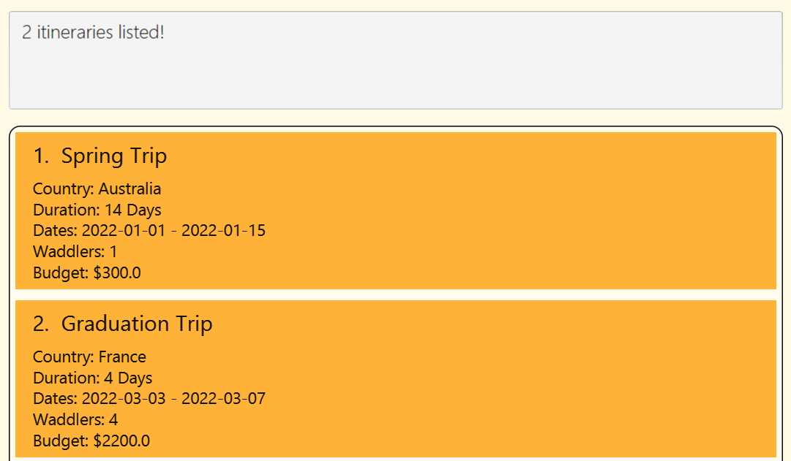
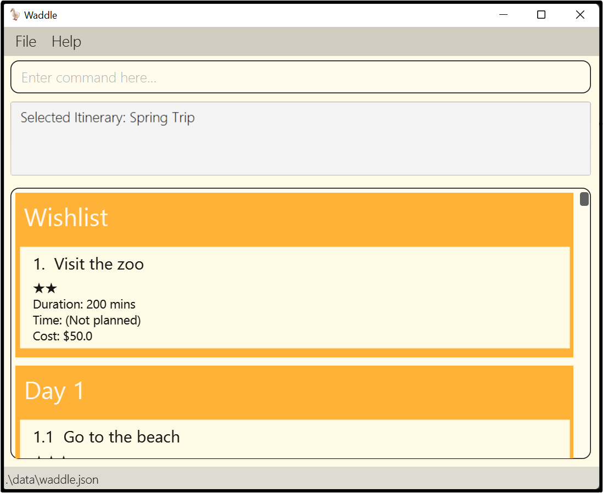
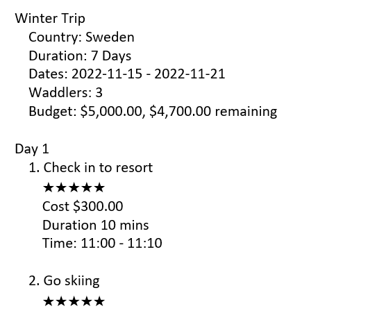
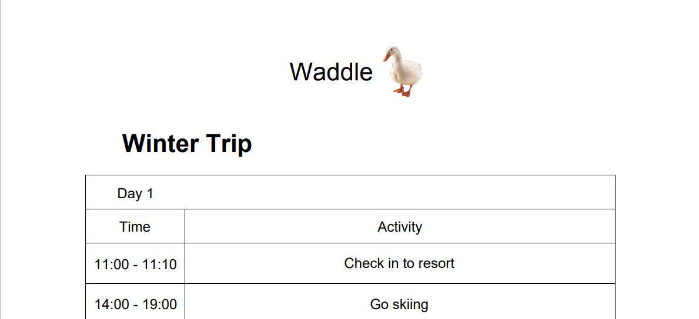

# Waddle User Guide 🦆
Waddle is a **simple, no-frills travel planning application catered to people who love doing everything on their keyboards**.

Waddle allows you to plan your travels in **3 simple steps**.
1. Create a trip itinerary
2. Add activities to your itinerary
3. Make a schedule for your trip

**It's that simple**.
--------------------------------------------------------------------------------------------------------------------

## Table of Contents

1. [**Quick start**](#quick-start)
2. [**Features**](#features)
   1. [**Universal commands**](#universal-commands)
      1. [`help` Viewing help](#viewing-help--help)
      2. [`exit` Exiting Waddle](#exiting-waddle--exit)
   2. [**The main page**](#the-main-page)
   3. [**Commands on main page**](#commands-on-the-main-page)
      1. [`add` Creating a new itinerary](#creating-a-new-itinerary--add)
      2. [`list` Listing all itineraries](#listing-all-itineraries--list)
      3. [`find` Locating itineraries by description](#locating-itineraries-by-description--find)
      4. [`edit` Editing the details of an itinerary](#editing-the-details-of-an-itinerary--edit)
      5. [`delete` Deleting an itinerary](#deleting-an-itinerary--delete)
      6. [`clear` Clearing itineraries](#clearing-itineraries--clear)
      7. [`select` Selecting an itinerary](#selecting-an-itinerary--select)
   4. [**The planning page**](#the-planning-page)
   5. [**Commands on item planning page**](#commands-on-the-item-planning-page)
      1. [`add` Adding an item](#adding-an-item--add)
      2. [`edit` Editing the details of an item](#editing-the-details-of-an-item--edit)
      3. [`delete` Deleting an item](#deleting-an-item--delete)
      4. [`free` Viewing vacant timeslots](#viewing-vacant-timeslots--free)
      5. [`plan` Scheduling an item](#scheduling-an-item--plan)
      6. [`unplan` Unscheduling an item](#unscheduling-an-item--unplan)
      7. [`copy` Copying to clipboard](#copying-to-clipboard--copy)
      8. [`pdf` Exporting as PDF file](#exporting-as-pdf-file--pdf)
      9. [`home` Returning to main page](#returning-to-main-page--home)
   6. [**Advanced**](#advanced)
      1. [Saving the data](#saving-the-data)
      2. [Editing the data file](#editing-the-data-file)
3. [**FAQ**](#faq)
4. [**Command summary**](#command-summary)
   1. [**Home page commands**](#home-page-commands)
   2. [**Item planning page commands**](#item-planning-page-commands)

--------------------------------------------------------------------------------------------------------------------

## Quick start

To begin planning your travels with Waddle, simply set it up as follows:

1. Ensure you have Java `11` or above installed in your Computer.

2. Download the latest `waddle.jar` from [here](https://github.com/AY2223S1-CS2103T-W11-4/tp/releases/).

3. Copy the file to the folder you want to use as the _home folder_ for Waddle.

4. Double-click the file to start the app. This will bring you to the Waddle [main page](#the-main-page). A graphical user interface (GUI) similar to the below should appear in a few seconds.
   Note how the app contains some sample data. 
   

And you're ready to waddle! To execute any command, type it command in the command box and press Enter. e.g. typing **`help`** and pressing Enter will open the help window.

Some example commands you can try:

   * **`list`** : Lists all itineraries.

   * **`add`** `d/My Japan Trip du/14 sd/2023-04-01` : Adds an itinerary for a 14-day trip named "My Japan Trip", which starts on the 1st of April 2023.
   
   * **`select`** `1` : Brings you into [the planning page](#the-planning-page) for the 1st itinerary shown in the current list.

   * **`delete`** `1` : Deletes the 1st itinerary shown in the current list.

   * **`exit`** : Exits the app.

For more commands and their details, refer to the [Features](#features) section below.

--------------------------------------------------------------------------------------------------------------------

## Features

**:information_source: Notes about the command format:** 

* Words in `UPPER_CASE` are the parameters to be supplied by the user. 
  - e.g. in `add d/DESCRIPTION ...`, `DESCRIPTION` is a parameter which can be used as `add d/My Japan Trip`.

* Unlesss stated otherwise, all parameters should contain alphanumerical characters only.

* Items in square brackets are optional. 
  - e.g. `d/DESCRIPTION [c/COUNTRY] sd/START_DATE du/DURATION` can be used as `d/My Japan Trip c/Japan sd/2023-04-01 du/14` or as `d/My Japan Trip sd/2023-04-01 du/14`.

* Parameters can be in any order. 
  - e.g. if the command specifies `c/COUNTRY d/DESCRIPTION`, `d/DESCRIPTION c/COUNTRY` is also acceptable.

* If a parameter is expected only once in the command, but you specified it multiple times, only the **last occurrence** of the parameter will be taken. 
  - e.g. if you specify `d/Eat Ramen d/Aquarium`, only `d/Aquarium` will be taken.

* Extraneous parameters for commands that do not take in parameters (such as `help`, `list`, `exit` and `clear`) will be ignored. 
  - e.g. if the command specifies `help 123`, it will be interpreted as `help`.

### Universal commands

Most commands in Waddle can only be used on the [main page](#the-main-page) or the [planning page](#the-planning-page). However, the commands in this section may be used on either page at any time.

### Viewing help : `help`

Brings up the help message, which contains a link to this guide.

Format: `help`

### Exiting Waddle : `exit`

Exits the Waddle program.

Format: `exit`

### The main page

The main page, or home page, of Waddle displays the list of itineraries you have created and stored in the app.

[Commands exclusive to the main page](#commands-on-the-main-page) can help you:
* [add](#creating-a-new-itinerary--add) new itineraries
* [view](#listing-all-itineraries--list) or [find](#locating-itineraries-by-description--find) existing itineraries
* [edit](#editing-the-details-of-an-itinerary--edit) or [delete](#deleting-an-itinerary--delete) existing itineraries
* [clear](#clearing-itineraries--clear) all existing itineraries

Using the [`select` command](#selecting-an-itinerary--select)  will bring you to the [planning page](#the-planning-page) of the selected itinerary.

### Commands on the main page

### Creating a new itinerary : `add`

Adds an itinerary to Waddle.

Format: `add d/DESCRIPTION sd/START_DATE du/DURATION [c/COUNTRY] [p/NUMBER_OF_WADDLERS] [b/BUDGET]`

* Adds a new itinerary named `DESCRIPTION` to the itinerary list. It cannot be blank and must only contain
alphanumeric characters, spaces and these following special characters: `()&!':.,-`.
* `START_DATE` is the date of the first day in the itinerary. It must be given in the format `yyyy-mm-dd` and is a valid future date.
* `DURATION` will determine the number of days in the itinerary, and must be between 1 and 365 days.
  - e.g. `sd/2022-12-10 du/3` would mean that the trip is from 10 Dec 2022 to 12 Dec 2022.
* `BUDGET` is the budget for the itinerary in dollars, or dollars and cents, and must be between 0 and 1,000,000.
  - e.g. `b/1000` is $1,000.
  - e.g. `b/1000.50` is $1,000.50.
  

**:information_source: Notes:** 

* You cannot add an itinerary with the same description as an existing itinerary. 

* Waddle only accepts english letters and spaces for `COUNTRY`, special characters like `'`, `&`, `!` are not allowed. 
  - Example of invalid input: `c/Côte d'Ivoire`, `c/中国`
* The budget input should only contain numbers and one decimal point. 
  - Example of invalid input: `b/1,000,000`
* If more than 2 decimal places are provided for the budget, Waddle rounds it up to 2 decimal places. 
  - e.g. `b/1000.505` will be reflected as $1,000.51.

### Listing all itineraries : `list`

Shows a list of all itineraries in Waddle.

Format: `list`

### Locating itineraries by description : `find`

Finds itineraries with descriptions containing any of the given keywords.

Format: `find KEYWORD [MORE_KEYWORDS]`

* The search is case-insensitive. e.g. `india` will match `India`
* The order of the keywords does not matter. e.g. `Trip Japan My` will match `My Japan Trip`
* The search is based on itinerary descriptions only.
* Only full words will be matched e.g. `Jap` will not match `Japan`
* Itineraries matching at least one of the provided keywords will be returned (i.e. `OR` search).
  - e.g. `find Japan Trip` will return `My Germany Trip`, since there is a match for the keyword  `Trip`.
* Use the [`list`](#listing-all-itineraries--list) command to see all itineraries again.

Examples:
* `find India` returns `My India Trip` and `India Expedition`
* `find India Trip` returns `My Japan Trip`, `My India Trip`, `India Expedition`
* `find trip` returns the following result:   
  

### Editing the details of an itinerary : `edit`

Edits an existing itinerary in Waddle.

Format: `edit INDEX [d/DESCRIPTION] [c/COUNTRY] [sd/START_DATE] [du/DURATION] [p/NUMBER_OF_WADDLERS] [b/BUDGET]`

* Edits the itinerary at the specified `INDEX`. The index refers to the index number shown in the displayed itinerary list. The index **must be a positive integer** 1, 2, 3, …​
* At least one of the optional fields must be provided.
* Existing values will be updated to the input values.

**:information_source: Notes:**  

* If you are editing the budget, please ensure that it is sufficient to cover the cost of all the planned items. An error would be shown otherwise. 
* If you reduce the duration of an itinerary, days will be removed from the back, and any items that were scheduled on a removed day would be returned to the Wishlist. 

Examples:
* `edit 1 du/15 sd/2023-11-03` Edits the duration and start date of the first itinerary to be `15` and `2023-11-03` respectively.
* `edit 2 c/India` Edits the country of the second itinerary to be `India`.

### Deleting an itinerary : `delete`

Deletes the specified itinerary from Waddle.

Format: `delete INDEX`

* Deletes the itinerary at the specified `INDEX`. The index refers to the index number shown in the displayed list of itineraries.
* The index **must be a positive integer** 1, 2, 3, …​

Examples:
* `list` followed by `delete 2` deletes the 2nd itinerary in Waddle.
* `find Japan` followed by `delete 1` deletes the 1st itinerary in the results of the `find` command.

### Clearing itineraries : `clear`

Deletes all itineraries in Waddle.

Format: `clear`

### Selecting an itinerary : `select`

Enters the [item planning page](#the-planning-page) for the selected itinerary.

Format: `select INDEX`

* Selects the itinerary at the specified `INDEX`. The index refers to the index number shown in the displayed list of itineraries.
* The index **must be a positive integer** 1, 2, 3, ...​

Examples:
* `select 1`

### The planning page

The planning page of an itinerary displays the list of items you have added to the itinerary. Items on the Wishlist that have not been added to you schedule yet will appear on top in order of priority, while scheduled items will appear in order of date and time.

The index of scheduled items are in the format `DAY.ITEM_NUMBER`. Some examples:
* The first item of the first day will have index `1.1`
* The fifth item of the third day will have index `3.5`
* The second item of the Wishlist will have index `2`

Here's an example of how the item planning page looks like:

[Commands exclusive to the planning page](#commands-on-the-planning-page) can help you:
* [add](#adding-an-item--add) new items
* [edit](#editing-the-details-of-an-item--edit) or [delete](#deleting-an-item--delete) existing items
* [view](viewing-vacant-time-slots--free) the vacant time slots on your itinerary
* [schedule](#scheduling-an-item--plan) or [unschedule](#unscheduling-an-item--unplan) items
* export your itinerary via your [clipboard](#copying-to-clipboard--copy) or as a [pdf](#exporting-as-pdf-file--pdf) file

Using the [`home` command](#returning-to-main-page--home)  will bring you to the [main page](#the-main-page) of the selected itinerary.

### Commands on the item planning page

### Adding an item : `add`

Adds an item to the wishlist without a scheduled day and time.

Format: `add d/DESCRIPTION du/DURATION [p/PRIORITY] [c/COST] `

* `DESCRIPTION` cannot be blank and must only contain alphanumeric characters, spaces and these following special characters: `()&!':.,-`.
* `DURATION` is the time taken for the item in _minutes_. The duration must be more than 0 minutes and not more than 1440 minutes (1 day).
    - e.g. `du/100` is 100 minutes (or 1 hour and 40 minutes).

* `PRIORITY` is used to rank the importance of an item. It must be a number from 1 to 5, with 1 being the highest priority.

* `COST` is the cost of the item in dollars, or dollars and cents, and must be between 0 and 1,000,000.
  - e.g. `c/100.20` is $100.20.

* You cannot add items with the same description as an existing item in the item list.

**:information_source: Note:** 
* If no `PRIORITY` or `COST` is provided, Waddle assigns them a default value as follows:
  * The default `PRIORITY` is 1. 
  * The default `COST` is $0. 
* The cost input should only contain numbers and one decimal point. 
  - Examples of invalid input: `c/1,000,000`
* If more than 2 decimal places are provided for the cost, Waddle rounds it up to 2 decimal places. 
  - e.g. `b/1000.505` will be reflected as $1,000.51.

Examples:
* `add d/Go to the Louvre p/2 du/1`
* `add d/Skiing du/14 c/100`

### Editing the details of an item : `edit`

Edits an existing item in the item list.

Format: `edit INDEX [d/DESCRIPTION] [p/PRIORITY] [c/COST] [du/DURATION]`

* Edits the item at the specified `INDEX`. The index refers to the index number displayed in either the wishlist, or the scheduled items in the day lists.
* The index of a scheduled item refers to the index number displayed in the list of days, the format being `DAY_NUMBER`.`ITEM_INDEX`.
* At least one of the optional fields must be provided.
* Existing values will be updated to the input values.

**:information_source: Note:**  

* If you are editing the cost, please ensure that the new cost stays within the budget of the itinerary. An error would be shown otherwise. 

Examples:
* `edit 1 d/Go skiing` would edit the description of the 1st item in the unscheduled item list to be `Go skiing`.
* `edit 2.2 p/3 c/100` would edit the priority and cost of the 2nd item in the Day 2 list to be `3` and `100` respectively.

### Deleting an item : `delete`

Deletes an existing item in the item list.

Format: `delete INDEX`

* Deletes the item at the specified `INDEX`. The index refers to the index number displayed in either the unscheduled item list, or the scheduled items in the day lists.

Examples:
* `delete 1` would delete the 1st item in the unscheduled item list.
* `delete 2.1` would delete the 1st item in the Day 2 item list.

### Viewing vacant timeslots : `free`

Displays the vacant timeslots available for scheduling items.

Format: `free`

### Scheduling an item : `plan`

Schedules an item from the Wishlist.

Format: `plan INDEX d/DAY_NUMBER st/START_TIME`

* Schedules the item at the specified `INDEX`. The index refers to the index number displayed in the Wishlist.
* When an item is scheduled, the cost of the item is automatically deducted from the budget of the itinerary.
* `DAY_NUMBER` must be an integer from 1 to the duration (in days) of the trip.
* `START_TIME` should be given in the format `hh:mm`, or `hh:mm:ss` where `hh` is the hour in 24-hour format, `mm` is the minute, and `ss` is the seconds.
* The end time of the item is automatically calculated by adding the `DURATION` of the item to the `START_TIME`.
* You can only add an item if there is no clash in timing between the start and end time of the new item, and the start and end time of any existing scheduled item.

**:information_source: Note:** 

* When scheduling an item, please ensure that the item stays within the budget of the itinerary. An error would be shown otherwise. 

Examples:
* `plan 2 d/3 st/12:00` would add the 2nd item in the Wishlist to Day 3, starting at 12pm.
* `plan 1 d/1 st/14:50:10` would add the 1st item in the Wishlist to Day 1, starting at 14:50pm, 10 seconds in.

### Unscheduling an item : `unplan`

Takes an item from the itinerary and puts it back into the Wishlist.

Format: `unplan INDEX`

* Unschedules the item at the specified `INDEX` as displayed on the day lists.
* When an item is unscheduled, its cost is automatically added back to the budget of the itinerary.

Examples:
* `unplan 2.1` would unschedule the 1st item in the Day 2 item list.
* `unplan 4.5` would unschedule the 5th item in the Day 4 item list.

### Copying to clipboard : `copy`

Copies the itinerary in a text format onto your device's clipboard so you can paste it anywhere.

Format: `copy`

Here's an example of how the copied text would look like:  

**:information_source: Note:**  

* The generated text includes all days within the itinerary, even if there are no items planned for the day. 

* The generated text does not include the items in the Wishlist. For items to be reflected in the generated text, they must be planned. 

### Exporting as PDF file : `pdf`

Exports the itinerary as a PDF file. The file can be found under the "Waddle" folder in your "Documents" folder.

[//]: # (TODO: include screenshots of where to find it for windows and mac, maybe linux but idk how)

Format: `pdf`

Here's an example of how the generated PDF would look like:  

**:information_source: Note:**  

* The generated PDF file does not contain the items in the Wishlist. For items to be reflected in the generated PDF file, they must be planned. 
* PDF can only display up to 35 characters for itinerary description and 50 characters for activity description.

### Returning to main page : `home`

Returns you to the main itinerary list page.

Format: `home`

### Advanced

### Saving the data

Waddle data is saved in the hard disk automatically upon any change in the data. There is no need to save manually.

### Editing the data file

Waddle data is saved as a JSON file `[JAR file location]/data/waddle.json`. Advanced users are welcome to update data directly by editing that data file.

:exclamation: <b>Caution:</b>
If your changes to the data file makes its format invalid, Waddle will discard all data and start with an empty data file at the next run. Please perform a backup before manually editing data.

--------------------------------------------------------------------------------------------------------------------

## FAQ

**Q**: How do I transfer my data to another computer? 
**A**: Install the app in the other computer and overwrite the empty data file it creates with the file that contains the data of your previous Waddle home folder.

--------------------------------------------------------------------------------------------------------------------

## Command summary

### Home page commands

| Action                                                           | Format, Examples                                                                                                                                                  |
| ------------------------------------------------------------------ |-------------------------------------------------------------------------------------------------------------------------------------------------------------------|
| [**Help**](#viewing-help--help)                                  | `help`                                                                                                                                                            |
| [**Add Itinerary**](#creating-a-new-itinerary--add)              | `add d/DESCRIPTION sd/START DATE du/DURATION [c/COUNTRY] [p/NUMBER OF WADDLERS] [b/BUDGET]`  e.g., `add d/Germanyyyy sd/2025-05-10 du/14 c/Germany p/4 b/7500` |
| [**List Itineraries**](#listing-all-itineraries--list)           | `list`                                                                                                                                                            |
| [**Edit Itinerary**](#editing-the-details-of-an-itinerary--edit) | `edit INDEX [n/NAME] [c/COUNTRY] [du/DURATION] [s/START DATE] [p/NUMBER OF WADDLERS] [b/BUDGET]`  e.g.,`edit 1 du/15 sd/2025-04-10`                            |
| [**Delete Itinerary**](#deleting-an-itinerary--delete)           | `delete INDEX`  e.g., `delete 3`                                                                                                                               |
| [**Clear Itineraries**](#clearing-itineraries--clear)            | `clear`                                                                                                                                                           |
| [**Find Itinerary**](#locating-itineraries-by-name--find)        | `find KEYWORD [MORE_KEYWORDS]`  e.g., `find India Trip`                                                                                                        |
| [**Select Itinerary**](#selecting-an-itinerary--select)          | `select INDEX`  e.g., `select 3`                                                                                                                               |
| [**Exit**](#exiting-waddle--exit)                                | `exit`                                                                                                                                                            |

### Item planning page commands

| Action                                                       | Format, Examples                                                                                         |
| -------------------------------------------------------------- | ---------------------------------------------------------------------------------------------------------- |
| [**Add Item**](#adding-an-item--add)                         | `add d/DESCRIPTION [p/PRIORITY] [c/COST] [du/DURATION]`  e.g.,`add d/Visit Taj Mahal p/5 c/40 du/180` |
| [**Edit Item**](#editing-the-details-of-an-item--edit)       | `edit INDEX [d/DESCRIPTION] [p/PRIORITY] [c/COST] [du/DURATION]`  e.g., `edit 4.1 c/50`               |
| [**Delete Item**](#deleting-an-item--delete)                 | `delete INDEX`  e.g., `delete 3`                                                                      |
| [**Schedule Item**](#scheduling-an-item--plan)               | `plan INDEX d/DAY NUMBER st/START TIME`  e.g., `plan 1 d/4 st/12:00`                                  |
| [**Unschedule Item**](#unscheduling-an-item--unplan)         | `unplan INDEX`  e.g., `unplan 3.2`                                                                    |
| [**View Vacant Timeslots**](#viewing-vacant-timeslots--free) | `free`                                                                                                   |
| [**Return to Main Page**](#returning-to-main-page--home)     | `home`                                                                                                   |
| [**Copy to clipboard**](#copying-to-clipboard--copy)         | `copy`                                                                                                   |
| [**Export to PDF**](#exporting-to-pdf-file--pdf)             | `pdf`                                                                                                    |
| [**Exit**](#exiting-waddle--exit)                            | `exit`                                                                                                   |
